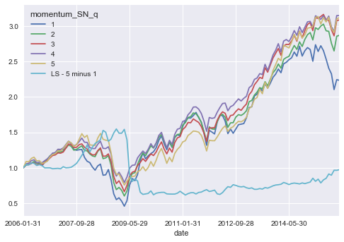

# Signal Backtester
### by Alex Chao

### Python package used to backtest and analyze univariate L/S signals


```python
import pandas as pd
import numpy as np
import os
import sys
%matplotlib inline
import matplotlib
import matplotlib.pyplot as plt
import seaborn as sns
sns.set()
from signalUnivariateStudy.SignalUnivariateStudy import SignalUnivariateStudy
```

Let's import some factor data


```python
list_factors = ['sector', 'momentum', 'quality', 'growth', 'vol', 'value', 'size']

df = pd.read_csv('./data/stock_data_actual_dates.csv').iloc[:, 1:]

```


```python
print(df.query("stock == 'S730' ").head())
```

          stock  sector   mktcap   momentum    quality     growth       vol  \
    87600  S730     5.0  2600.28   9.725409  10.989148  -85.71429  2.960924
    87601  S730     5.0  2954.44  28.754772  10.989148  -85.71429  2.866734
    87602  S730     5.0  2949.78  55.905945  10.989148  -85.71429  2.862670
    87603  S730     5.0  2994.03  83.528853   8.517243 -114.28571  2.791819
    87604  S730     5.0  2619.63  58.462116   8.517243 -114.28571  2.580692

              value  fwd_returns    returns dummy_date        date      size
    87600  3.270610    13.620072        NaN       D000  2006-01-31  7.863374
    87601  2.878549    -0.157729  13.620072       D001  2006-02-28  7.991064
    87602  2.883097     1.066351  -0.157729       D002  2006-03-31  7.989486
    87603  2.227433   -12.504885   1.066351       D003  2006-04-28  8.004376
    87604  2.545780   -19.964270 -12.504885       D004  2006-05-31  7.870788


Now, lets quickly run the signal univariate backtester. We'll backtest sector-neutralized Momentum


```python
bt = SignalUnivariateStudy(data_df=df,
                            factor_name='momentum',
                            stock_col_name = 'stock',
                            neutralizer_column='sector',
                            order='asc',
                            n=5)

```

    neutralizing factor = momentum using sector


```python
print(bt.stats)
```

    momentum_SN_q           1           2           3           4           5  \
    returns          0.114943    0.127207    0.129813    0.130302    0.131109
    volatility        0.26509    0.201977    0.176341    0.166918    0.176751
    sharpe           0.433599    0.629807    0.736147    0.780634    0.741775
    tstat             1.37116     1.99163      2.3279     2.46858      2.3457
    maxDD            0.666373    0.545323    0.504372    0.442387    0.491306
    start_dt       2006-01-31  2006-01-31  2006-01-31  2006-01-31  2006-01-31
    end_dt         2015-12-31  2015-12-31  2015-12-31  2015-12-31  2015-12-31
    freq                month       month       month       month       month
    order                 asc         asc         asc         asc         asc
    n_buckets               5           5           5           5           5

    momentum_SN_q LS - 5 minus 1
    returns            0.0161663
    volatility          0.182462
    sharpe             0.0886006
    tstat                0.28018
    maxDD               0.602826
    start_dt          2006-01-31
    end_dt            2015-12-31
    freq                   month
    order                    asc
    n_buckets                  5


We can also easily print the returns and wealth curve for this backtest


```python
bt.rets.tail()
```


<div>
<style>
    .dataframe thead tr:only-child th {
        text-align: right;
    }

    .dataframe thead th {
        text-align: left;
    }

    .dataframe tbody tr th {
        vertical-align: top;
    }
</style>
<table border="1" class="dataframe">
  <thead>
    <tr style="text-align: right;">
      <th>momentum_SN_q</th>
      <th>1</th>
      <th>2</th>
      <th>3</th>
      <th>4</th>
      <th>5</th>
      <th>LS - 5 minus 1</th>
    </tr>
    <tr>
      <th>date</th>
      <th></th>
      <th></th>
      <th></th>
      <th></th>
      <th></th>
      <th></th>
    </tr>
  </thead>
  <tbody>
    <tr>
      <th>2015-08-31</th>
      <td>-0.051214</td>
      <td>-0.003109</td>
      <td>-0.002178</td>
      <td>0.020659</td>
      <td>0.021275</td>
      <td>0.072489</td>
    </tr>
    <tr>
      <th>2015-09-30</th>
      <td>-0.032327</td>
      <td>-0.057039</td>
      <td>-0.042582</td>
      <td>-0.047576</td>
      <td>-0.050528</td>
      <td>-0.018201</td>
    </tr>
    <tr>
      <th>2015-10-30</th>
      <td>-0.095990</td>
      <td>-0.039645</td>
      <td>-0.029885</td>
      <td>-0.023805</td>
      <td>-0.018143</td>
      <td>0.077847</td>
    </tr>
    <tr>
      <th>2015-11-30</th>
      <td>0.066595</td>
      <td>0.078459</td>
      <td>0.075463</td>
      <td>0.078000</td>
      <td>0.064924</td>
      <td>-0.001671</td>
    </tr>
    <tr>
      <th>2015-12-31</th>
      <td>-0.004069</td>
      <td>0.004671</td>
      <td>0.002731</td>
      <td>0.000450</td>
      <td>0.005873</td>
      <td>0.009942</td>
    </tr>
  </tbody>
</table>
</div>


```python
bt.wealth.plot()
```


    <matplotlib.axes._subplots.AxesSubplot at 0x11f429160>





```python

```
